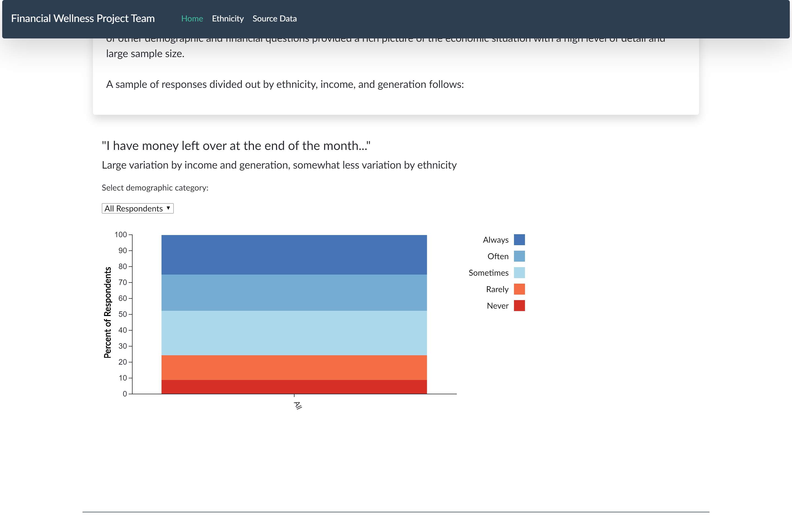
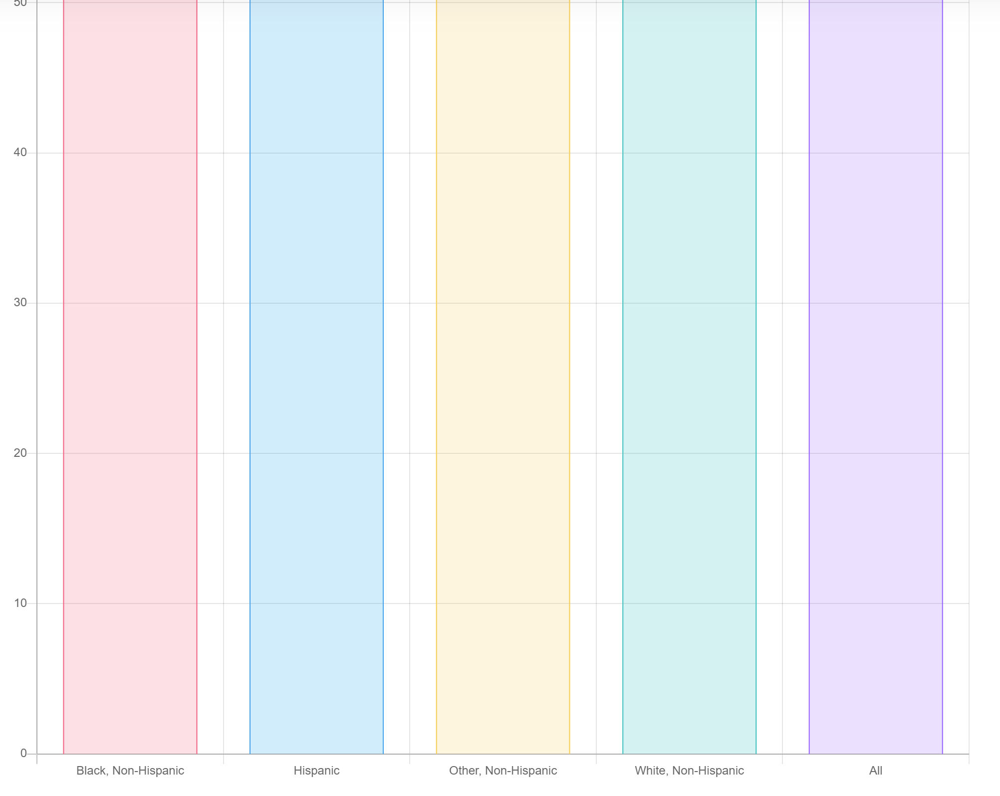

Database, ETL, SCRUB Project

Because this is a dynamic website that uses MySQL, it requires hosting somewhere other than Github. For convenience, I have attached a bunch of pictures of what the site does when it is running or if you choose to download it and run it on your localhost.
 
Interactive graphs with data from the Consumer Financial Protection Bureau that shows the financial well-being of people in multiple categories such as ethnicity, generation, and income. 
• Used Python (pandas, pymongo) to scrub data.
• Created an app with python to clean up CSVs, sent them to flask and then MongoDB (NoSQL) database.
•Lastly, created a site with interactive graphs using JavaScript and D3. 
This is what the landing page looks like. The rest of the pictures on this ReadMe show what happens when you click on the drop down menus.

This chart was created using chart.js It is much uglier and less interactive than the other graphs but took a fraction of the time to make. 
This is a summary of the data.

